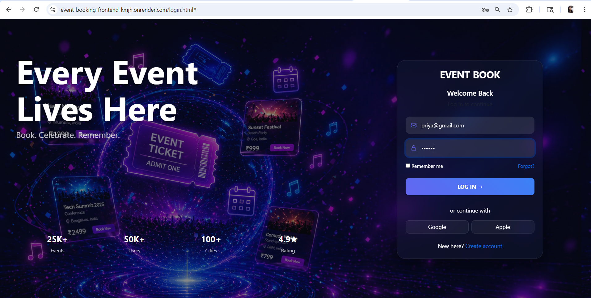
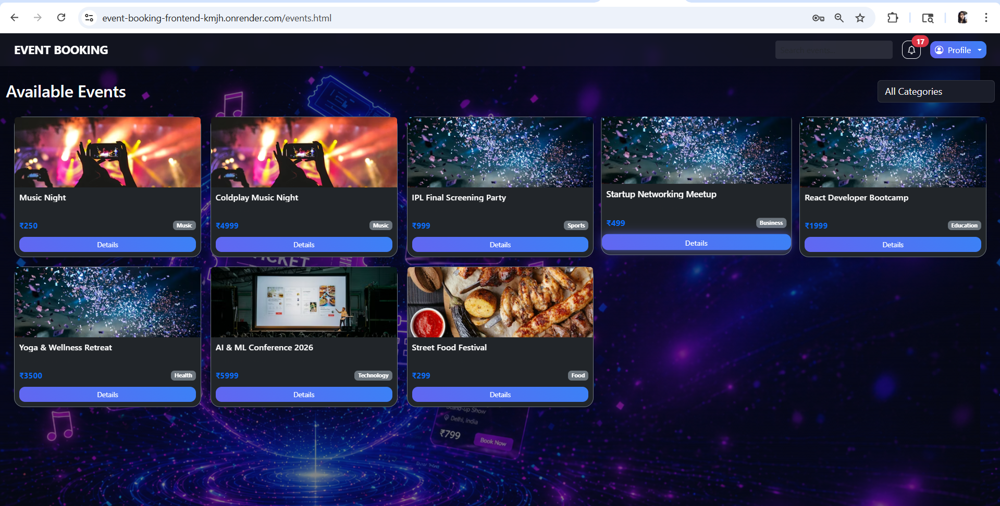

# 🎟️ Event Booking System

A full-stack event booking platform built using **FastAPI (Python)** for backend and **HTML, CSS, Bootstrap, JavaScript** for frontend.  

The system supports authentication, role-based access (User/Admin), event management, booking system, notifications, and analytics dashboard.

---

##  Live Demo
- Frontend: https://event-booking-frontend-kmjh.onrender.com
- Backend API: https://event-booking-api-gnww.onrender.com/docs

---

##  Features

### 👤 User Features
- User registration & login (JWT authentication)
- Browse events with filters (category, search, pagination)
- View event details
- Book events with seat management
- View personal bookings
- Notifications system
- Category-based browsing

### 🛠 Admin Features
- Admin dashboard with analytics
- Manage users (view/delete)
- Create, update, delete events
- Manage bookings (cancel bookings)
- Category management
- Revenue & booking analytics charts

---

##  Tech Stack

### Backend
-  FastAPI (Python)
- SQLAlchemy ORM
- SQLite Database
- JWT Authentication
- Pydantic validation
- CORS Middlewar

### Frontend
- HTML5
- CSS3
- Bootstrap 5
- JavaScript (Vanilla JS)

### Tools & Libraries
- Uvicorn (ASGI server)
- Passlib (Password hashing)
- Python-dotenv
- Alembic (if migrations used)

### Deployment
- Backend: Render (FastAPI + Uvicorn)
- Frontend: Render (Static Hosting)

Environment Variables:
- DATABASE_URL
- SECRET_KEY
- ALGORITHM
- ACCESS_TOKEN_EXPIRE_MINUTES

---

##  Project Structure
```
Event Booking System
│
├── event-booking-api/              # FastAPI Backend
│   ├── core/                       # Security, JWT auth, rate limiting
│   │   ├── security.py
│   │   └── limiter.py
│   │
│   ├── routers/                    # API endpoints (auth, events, admin, bookings))
│   │   ├── auth.py
│   │   ├── events.py
│   │   ├── bookings.py
│   │   ├── admin.py
│   │   ├── analytics.py
│   │   ├── profile.py
│   │   ├── payment.py
│   │   └── engagement.py
│   │
│   ├── utils/                      # Helper functions
│   │   └── helpers.py
│   │
│   ├── uploads/                    # Uploaded files (images, etc.)
│   │   └── .gitkeep
│   │
│   ├── database.py                 # DB connection
│   ├── models.py                   # ORM models
│   ├── schemas.py                  # Request/response validation (Pydantic schemas)
│   ├── main.py                     # FastAPI entry point
│   ├── requirements.txt            # Python dependencies
│   ├── .env                        # Environment variables
│   ├── .gitignore                  # Backend ignore rules
│   └── events.db                   # SQLite database
│
├── frontend/                       # Frontend UI (HTML, CSS, JS)
│   ├── css/                        # Stylesheets
│   │   ├── common.css              # Global styles
│   │   ├── login.css
│   │   ├── events.css
│   │   ├── event-details.css
│   │   ├── my-bookings.css
│   │   └── notifications.css
│   │    
│   │
│   ├── js/                         # Frontend logic
│   │   ├── login.js                # Login/register logic
│   │   ├── events.js               # Event listing & booking
│   │   ├── event-details.js
│   │   ├── admin.js                # Admin dashboard logic
│   │   ├── my-bookings.js
│   │   ├── notifications.js
│   │   ├── profile.js
│   │   └── chart.js
│   │
│   ├── images/                     # Static assets
│   │   └── login-bg.jpg
│   │
│   ├── index.html                  # Landing page
│   ├── login.html                  # Auth page
│   ├── events.html                 # Events listing
│   ├── event-details.html          # Event detail view
│   ├── admin.html                  # Admin dashboard
│   ├── my-bookings.html            # User bookings
│   ├── notifications.html          # Notifications page
│   └── profile.html                # User profile
│
├── assets/
│   └── screenshots/                # UI screenshots
│       ├── login.png
│       └── event.png
│
├── docs/                           # Project documentation (optional but recommended)
│   ├── architecture.md
│   └── api-reference.md
│
├── .gitignore                     # Global ignore (frontend + backend)
├── LICENSE                        # MIT License
└── README.md                      # Project documentation
```
---

##  Architecture
- Layered FastAPI backend architecture
- Router-based modular design (auth, events, bookings, admin, analytics, etc.)
- JWT-based authentication with role-based access control (User/Admin)
- SQLAlchemy ORM for database abstraction
- RESTful API-based backend design
- Stateless frontend consuming APIs via fetch
- Modular separation of concerns (core, routers, utils, models, schemas)

---

## Authentication

- JWT-based login system
- Role-based access:
  - `user`
  - `admin`

---

##  API Overview

### Auth
- POST `/api/auth/register`
- POST `/api/auth/login`

### Events
- GET `/api/events/events`
- POST `/api/events/events`
- PUT `/api/events/events/{id}`
- DELETE `/api/admin/admin/events/{id}`

### Bookings
- POST `/api/book`
- GET `/api/my-bookings`
- DELETE `/api/admin/admin/bookings/{id}`

### Admin
- GET `/api/admin/admin/users`
- GET `/api/admin/admin/bookings`

### Analytics
- GET `/api/analytics/stats`
- GET `/api/analytics/admin/analytics/revenue-trend`
- GET `/api/analytics/admin/analytics/bookings-trend`

---

##  Key Highlights

- Real-time seat management
- Admin analytics dashboard with charts
- Secure JWT authentication
- Fully RESTful API design
- Responsive UI

---

## Screenshots 

#### Login Page
>Secure authentication system with JWT-based login and role detection.



>List of all events happening across the country




---

##  Setup Instructions

### Backend
```bash
pip install -r requirements.txt
uvicorn main:app --reload
```

### Frontend
```
Open:
frontend/index.html
```

---

## Deployment
Backend: Render

Frontend: Render

---
##  Author

Priyanka Srivastava

Full Stack Developer (FastAPI + JS)

---
## Future Improvements
Payment gateway integration

Email notifications

Seat locking system (real-time)

React frontend migration
